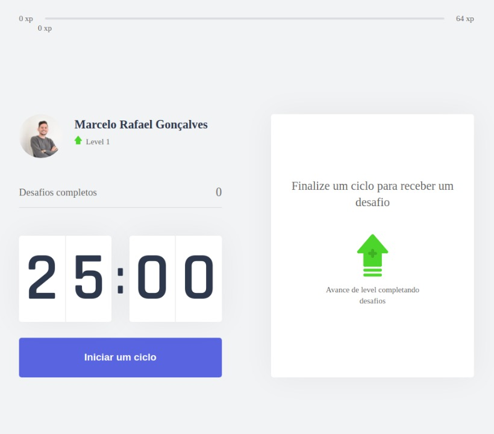

<p align="center">
  
</p>

<h1 align="center">
🚧 MoveIt 2.0 | Em Construção 🚧
</h1>
 
 <div align="center">

 ![BADGE_OPEN_SOURCE] ![BADGE_OPEN_ISSUES] ![BADGE_CLOSED_ISSUES] ![BADGE_STARS] ![BADGE_FORKS]

<!-- Badges -->

[BADGE_CLOSED_ISSUES]: https://img.shields.io/github/issues-closed/marcelo-rafael/nlw-04-moveit?color=blue

[BADGE_OPEN_ISSUES]: https://img.shields.io/github/issues/marcelo-rafael/nlw-04-moveit?color=blue

[BADGE_STARS]: https://img.shields.io/github/stars/marcelo-rafael/nlw-04-moveit?style=social

[BADGE_FORKS]: https://img.shields.io/github/forks/marcelo-rafael/nlw-04-moveit?style=social

[BADGE_OPEN_SOURCE]: https://badges.frapsoft.com/os/v1/open-source.png?v=103

  
  
  

  
  
  
  
  <a href="https://github.com/marcelo-rafael/nlw-04-moveit/commits/master">
      
  </a>
  
  <a href="https://github.com/marcelo-rafael/nlw-04-moveit/stargazers">
    
  </a>
  
</div>

<h1 align="center">
  Bem Vindo ao MoveIt 2.0
</h1>

<p align="center">
 <a href="#-sobre-o-projeto">Sobre</a> • 
 <a href="#-funcionalidades">Funcionalidades</a> • 
 <a href="#-layout">Layout</a> • 
 <a href="#-melhorias-na-aplicacao">Melhorias na Aplicação</a> • 
 <a href="#-como-executar-o-projeto">Como executar</a> • 
 <a href="#-tecnologias">Tecnologias</a> • 
 <a href="#-autor">Autor</a> • 
 <a href="#user-content--licença">Licença</a> • 
</p>

## 🚀 Sobre o Projeto

O move.it é um projeto que visa adicionar gamificação na sua rotina de trabalho, trazendo exercícios para o corpo e olhos a cada período de foco.

### :information_source: O que é Next Level Week?

O [NLW](https://nextlevelweek.com/inscricao/6) é uma semana prática com muito código, desafios, network e com um único objetivo: levá-lo ao próximo nível.
Através do método da [Rocketseat](https://nextlevelweek.com/inscricao/1), você aprenderá novas ferramentas, tecnologias e descobrirá hacks que irão impulsionar sua carreira.
Um evento online e totalmente gratuito que o ajudará a dar o próximo passo na sua evolução como desenvolvedor.

---

## ⚙️ Funcionalidades

- [x] Empresas ou entidades podem se cadastrar na plataforma web enviando:
  - [x] uma imagem do ponto de coleta
  - [x] nome da entidade, email e whatsapp
  - [x] e o endereço para que ele possa aparecer no mapa
  - [x] além de selecionar um ou mais ítens de coleta: 
    - lâmpadas
    - pilhas e baterias
    - papéis e papelão
    - resíduos eletrônicos
    - resíduos orgânicos
    - óleo de cozinha

- [x] Os usuários tem acesso ao aplicativo móvel, onde podem:
  - [x] navegar pelo mapa para ver as instituições cadastradas
  - [x] entrar em contato com a entidade através do E-mail ou do WhatsApp

---

## 🎨 Layout

O layout da aplicação está disponível no Figma:

<a href="https://www.figma.com/file/vRbW1u0CEZuG2zE6bU5qLg/Move.it-2.0?node-id=160%3A2761">
  
</a>

Design feito por [Tiago Luchtenberg](https://www.instagram.com/tiagoluchtenberg/)

---

### Web

<h4 align="center">
  
</h4>

---
<!--
## :tada: Melhorias na Aplicação

    -Adicionado api serverless na aplicação;
    -Adicionado Firebase para efetuar autenticação;
    -Adicionado mongodb para salvar informações;
    
    ---
    -->
    
## :tada: Melhorias na Aplicação


    - [] Login no Github
    - [] Opção de PWA na APlicação
    - [] Pagina de Leaderboard na aplicação
    - [] Theme dark na aplicação
    - [] Switch para alterar os themes
    - [] Save theme no localStorage
    - [] Autenticação com github
    - [] Toast como notificação
    - [] Test com Jest;
    - [] storybook para os component;
    - [] Ícones para representar os botões
    - [] Desenvolver a estilização e deixar responsivo
    - [] Efetuar ajustes para o mobile e PWA
    - [] Compartilhar com Redes Sociais
    - [] Adicionar uma SideBar
    - [] Adicionar component para SEO;
    
---

## 🚀 Como executar o projeto

### Pré-requisitos

Antes de começar, você vai precisar ter instalado em sua máquina as seguintes ferramentas:
[Git](https://git-scm.com), [Node.js](https://nodejs.org/en/). 
Além disto é bom ter um editor para trabalhar com o código como [VSCode](https://code.visualstudio.com/)

---

### Clonando o repositório

```

```bash
# Clone este repositório
$ git clone https://github.com/marcelo-rafael/nlw-04-moveit

# Acesse a pasta do projeto no terminal/cmd
$ cd nlw-04-moveit
```

### Rodando a Aplicação

```bash
# Instale as dependências
$ yarn or npm install

# Execute a Aplicação em Desenvolvimento
$ yarn dev or npm run start

# A aplicação será aberta na porta:3000 - acesse http://localhost:3000

```

---

## 🔎 Comandos

- `dev`: Executa a aplicação em `localhost:3000`
- `build`: Cria a Build do projeto
- `start`: Inicia um servidor simples com o código de produção

---
    
## 🛠 Tecnologias:

As seguintes ferramentas foram usadas na construção do projeto:

#### **Website**  ([Next.js](https://nextjs.org/)  +  [TypeScript](https://www.typescriptlang.org/))

- **[Eslint](https://eslint.org/)**
- **[Prettier](https://prettier.io/)**

---

<!--
### 💾 Comandos Úteis

```bash
#Criação de um componente completo com (index.tsx / stories.tsx / styles.ts / test.tsx)
$ yarn generate ComponentName

#Rodar o Storybook
$ yarn storybook

#Rodar os testes
$ yarn test

```
-->

<!--
### 📁 Configuração .ENV

```bash
#adicionado .env.example no projeto, lembrar de adicionar as variáveis de ambiente conforme o exemplo

# FIREBASE
NEXT_PUBLIC_APIKEY=
NEXT_PUBLIC_AUTHDOMAIN=
NEXT_PUBLIC_PROJECTID=
NEXT_PUBLIC_STORAGEBUCKET=
NEXT_PUBLIC_MESSAGINGSENDERID=
NEXT_PUBLIC_APPID=
NEXT_PUBLIC_MEASUREMENTID=

# MONGODB
MONGODB_URI=

# API URLS
BASE_URL=


```

-->

## 💪 Como contribuir para o projeto

1. Faça um **fork** do projeto.
2. Crie uma nova branch com as suas alterações: `git checkout -b my-feature`
3. Salve as alterações e crie uma mensagem de commit contando o que você fez: `git commit -m "feature: My new feature"`
4. Envie as suas alterações: `git push origin my-feature`

> Caso tenha alguma dúvida confira este [guia de como contribuir no GitHub](https://github.com/firstcontributions/first-contributions)

---

## **:star2: AGRADECIMENTOS**

<div align=center>

<table style="width:100%">
  <tr align=center>
    <th><strong>Next Level Week</strong></th>
    <th><strong>Rocketseat</strong></th>
    <th><strong>diego3g</strong></th>
    <th><strong>maykbrito</strong></th>
  </tr>
  <tr align=center>
    <td>
      <a href="https://nextlevelweek.com/">
        
      </a>
    </td>
    <td>
      <a href="https://rocketseat.com.br/">
        
      </a>
    </td>
    <td>
      <a href="https://github.com/diego3g">
        
      </a>
    </td>
    <td>
      <a href="https://github.com/maykbrito">
        
      </a>
    </td>
  </tr>
</table>

</div>

---

# :man: Autor


## 🔗 Links

[](https://www.linkedin.com/in/marcelo-rafael-gonçalves/)
[](mailto:marcelo.rafael.goncalves@gmail.com)

---

## **:page_with_curl: LICENÇA**

Esse repositório está licenciado pela **MIT LICENSE**. Para mais informações detalhadas, leia o arquivo [LICENSE](./LICENSE) contido nesse repositório. 

<h3 align="center">
Feito com ❤️ por <a href="https://www.linkedin.com/in/marcelo-rafael-goncalves/">Marcelo Rafael Gonçalves 💜🚀</a>
</h3>


